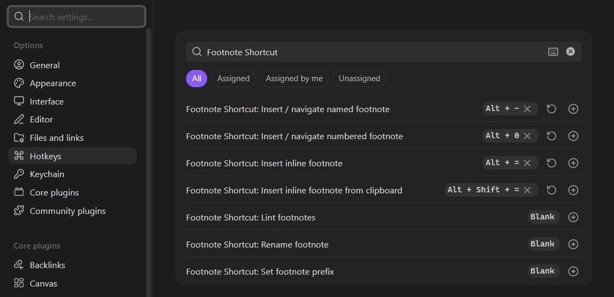
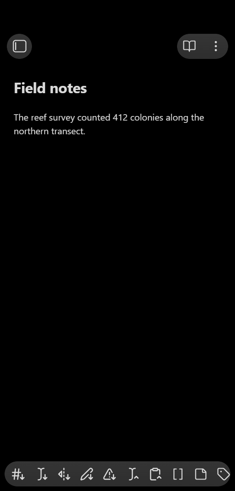
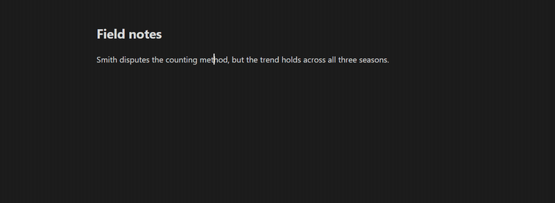
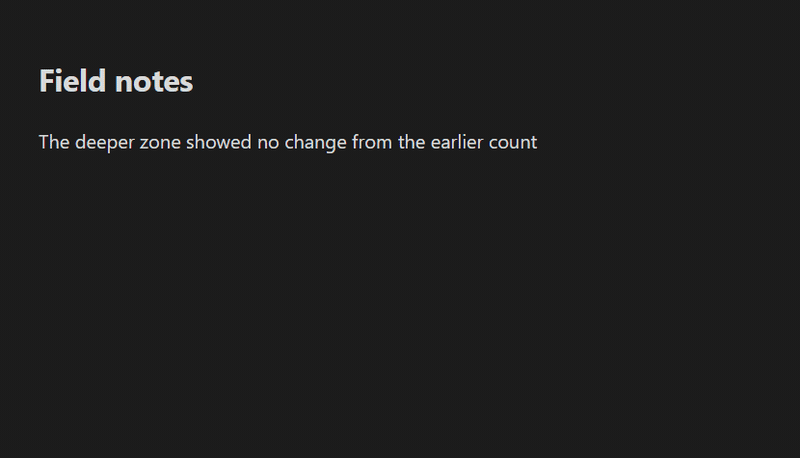
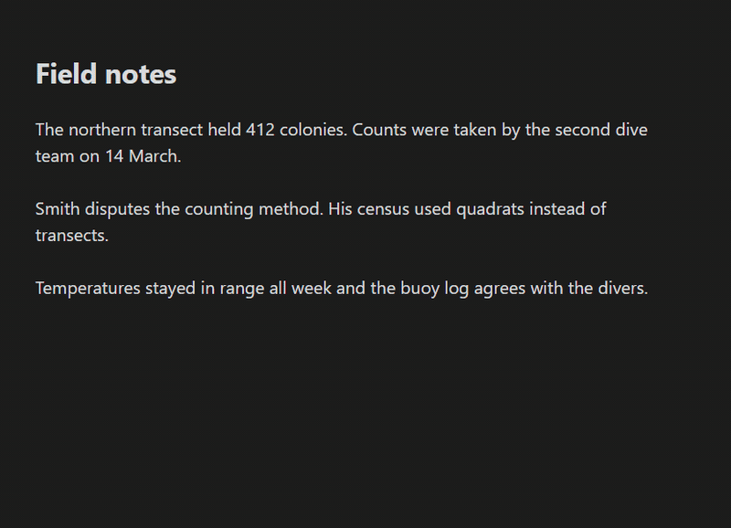
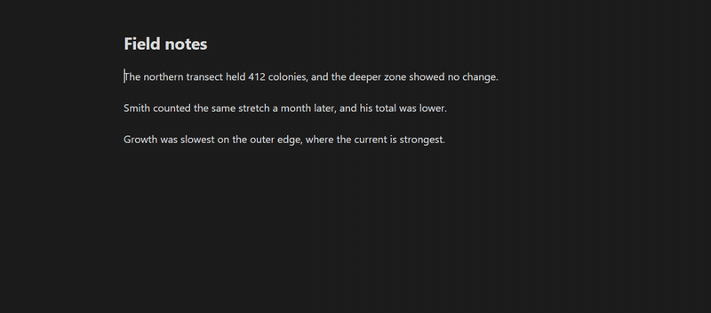
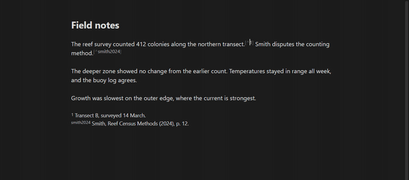
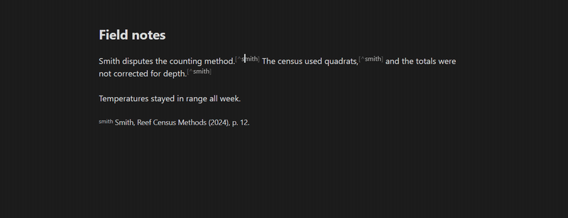
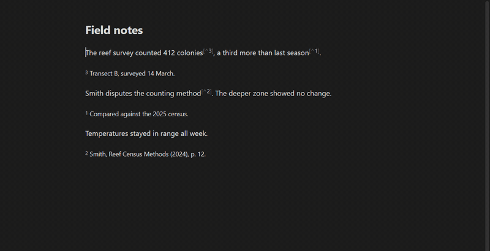
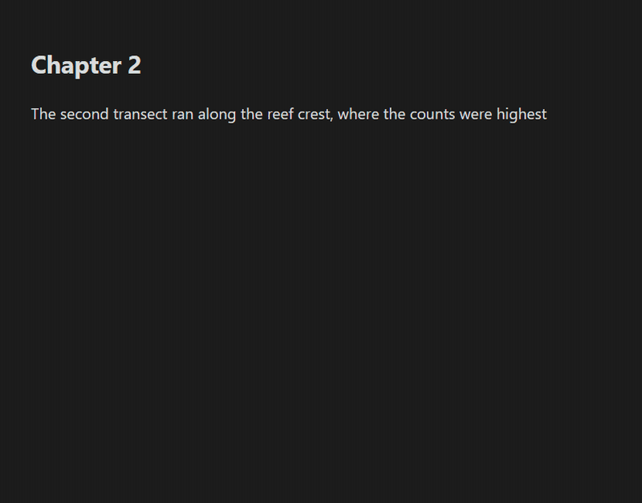

# Footnote Shortcut

  

Create, navigate, and edit Obsidian footnotes all from the keyboard:

- **One hotkey for footnote creation/editing**: insert a new footnote, and jump between the footnote reference and its definition
- **Popup editor**: edit the footnote right at your cursor, no scrolling to the bottom
- **Numbered, named, and inline** footnote styles
- **Selection to footnote**: turn text you already wrote into a footnote with one press
- **Rename a footnote** everywhere at once, like renaming a variable in a code editor
- **Footnote linter** to keep footnote formatting tidy
- **Per-note footnote prefixes** keep footnotes unique even when multiple chapters are merged into a larger document, such as with the [Longform](https://github.com/kevboh/longform) or [Easy Bake](https://github.com/community-archive/obsidian-easy-bake) plugins
- Works on Obsidian Mobile

## Support the plugin

If this plugin has made your writing a little smoother, you can [buy me a coffee](https://ko-fi.com/comprehensivejason). Tips go toward the hours I spend on bug-hunting, feature requests, and keeping up with Obsidian releases.

Bug reports and feature ideas on the [issue tracker](https://github.com/MichaBrugger/obsidian-footnotes/issues) are just as welcome.

## FIRST: set up your hotkeys

The plugin adds its commands **without hotkeys**, so assign your own right after installing by going to:

`Settings → Hotkeys → search for "Footnote Shortcut" → click the ⨁ next to a command → press your preferred keys`

Of the plugin's 10 commands, the ones you'll press constantly should have hotkeys. I personally use:

| Command                               | Recommended hotkey                           |
| ------------------------------------- | -------------------------------------------- |
| Insert / navigate numbered footnote   | <kbd>Alt</kbd>+<kbd>0</kbd>                  |
| Insert / navigate named footnote      | <kbd>Alt</kbd>+<kbd>-</kbd>                  |
| Insert inline footnote                | <kbd>Alt</kbd>+<kbd>=</kbd>                  |
| Insert inline footnote from clipboard | <kbd>Alt</kbd>+<kbd>Shift</kbd>+<kbd>=</kbd> |

The other 6 (**Lint footnotes**, **Rename footnote**, **Delete footnote everywhere**, the two **Convert** commands, and **Set footnote prefix**) come up less often, so running them from the command palette works fine. Give them hotkeys too if they become part of your routine.

Everything also works on mobile from the toolbar, each with their own unique toolbar icons.

## Creating footnotes

### Numbered footnotes

Put your cursor where the footnote belongs and press the hotkey. The plugin finds the next free number, inserts the reference (say `[^1]`), creates the matching `[^1]: ` definition at the bottom of the note, and lets you type the definition text immediately.

Footnotes are never created inside code, math, comments, frontmatter, or another footnote's definition, where they would be invalid. The plugin refuses in those locations and alerts you.

### Named footnotes

Named footnotes (like `[^smith2024]`) take 2 quick presses:

1. **First press** inserts an empty reference `[^]` with your cursor between the brackets. Type the name.
2. **Second press** (with your cursor still on the reference) creates the matching `[^smith2024]: ` line and lets you write the definition text.

Names can hold almost anything (`[^smith2024]`, `[^arXiv:1234.5678]`, `[^注]`). The exceptions are spaces, backticks, brackets, and `#`, which Obsidian can't render or find. The plugin refuses those invalid characters and alerts you.

### Inline footnotes

2 commands cover Obsidian's inline `^[...]` style:

- **Insert inline footnote** places `^[]` with your cursor inside, ready to type. Press the hotkey again when you're done and the cursor hops out past the closing bracket, so you never need the arrow keys.
- **Insert inline footnote from clipboard** wraps whatever you've copied into `^[...]` in one press. Multi-line clipboard text is flattened to one line, and anything that would break the footnote (e.g. stray brackets) is escaped automatically.

### Inside tables

Footnotes work in table cells too: the reference goes into the cell and the definition lands below the table. Undoing a footnote made from a cell can take 2 undos, because the cell and the note are separate editors. A notice tells you when the first undo has only removed the definition, and whether a second undo removes the reference too.

### Turn selected text into a footnote

Sometimes you write something mid-sentence and realize it should be a footnote. Select it and press a footnote hotkey:

- The **numbered** hotkey replaces the selection with the next numbered footnote reference and moves the selected text into that footnote's definition. Multi-paragraph selections work too: the whole block becomes one multi-paragraph footnote, including whole code blocks, callouts, etc.
- The **named** hotkey asks you for a name first, then does the same under `[^yourname]`. Confirm with Enter, the Create button, or just press any footnote hotkey again.
- The **inline** hotkey wraps the selection as `^[...]` right where it is. It accepts single-line selections only, as only those format correctly. For a multi-line selection, it points you to the previous 2.
- A selection that starts or ends mid-word grows to whole words first, plus one trailing punctuation mark, so a sloppy drag still produces a clean footnote. Turn **Expand selections to whole words** off in the settings if you want the exact selection.
- A selection that contains/cuts-through an existing footnote refuses to convert, as footnotes can't be nested inside other footnotes. Nesting is prevented throughout the plugin, and linting alerts you if a note already has hand-typed nesting.
- Tables: text inside one cell converts, as well as a whole table selected edge to edge (with or without the text around it). A selection that cuts through a table's pipes refuses, to avoid breaking the table.

### Creating footnotes at multiple cursors

**Multiple cursors** (<kbd>Alt</kbd>+<kbd>click</kbd>) get the same footnote at every one of them, handy when one source is cited in several places:

- The numbered hotkey puts the same `[^N]` at every cursor, sharing a single definition.
- The named hotkey drops footnote brackets around every cursor and leaves a cursor inside each pair, so you type the name once and it lands everywhere. Press the hotkey again with the cursors still inside to create the shared definition.
- The inline hotkey also drops footnote brackets around every cursor, so you type the footnote text once and it lands everywhere.
- Pasting as an inline footnote wraps the same clipboard text at every cursor.

If any cursor sits where a footnote can't go, nothing is inserted anywhere. Every multi-cursor insertion ends with a single cursor after the first reference.

## Navigating footnotes

The insert hotkeys double as navigation. What they do depends on where your cursor is:

- **On a footnote reference** (inside `[^3]` in your text): open its definition in a popup right at your cursor (or by jumping to the definition, when the footnote popup is off).
- **On a footnote definition at the bottom** (a `[^3]: …` line): jump back to where its reference is used in your text.
- **Anywhere else**: insert a new footnote, as described above.

One hotkey takes you back and forth between a reference and its note.

### Renaming a footnote

Put your cursor on any reference or definition and run **Rename footnote**. It works like renaming a variable in a code editor: every reference and the definition get the new name in one step. It's also in the right-click menu when you click on a footnote, just like Obsidian's own rename for headings. Names are case-insensitive, so `[^Note]` and `[^note]` count as the same footnote. The command refuses names that are already taken and names a footnote can't have, and under a per-note prefix the new name gets the prefix added for you.

### Deleting a footnote

Put your cursor on any reference or definition and run **Delete footnote everywhere**. The definition and every reference to it go in one step and one undo (the name was "Delete footnote definition and all references" until the right-click menu proved too narrow for it), and the toast tells you how many of each went. It's also in the right-click menu on a footnote, next to Obsidian's own **Delete footnote and reference**, which removes only the one reference you clicked: if the same footnote is cited in two places, Obsidian's item leaves the other reference behind pointing at nothing. Copies inside code, math or comments are plain text and stay. A deletion that would change how Obsidian reads the surrounding text (a definition inside a list item that runs over more than one line, a definition sharing its line with the end of a `%%` comment) is refused with a reason instead of half done.

### Copying, cutting and pasting footnotes

Copy or cut text that holds footnote references and the definitions come along. Nothing to run: it hooks the keys you already press, within one Obsidian window.

- **Copy** remembers which definitions the selection needs, including a definition that another carried definition cites. The clipboard text itself stays clean, so pasting into other apps is unchanged.
- **Paste** lands the text and the definitions in one undo, where a new footnote would go. A definition the destination already has (same text, whatever its name) is reused; a name the destination already uses for something else is renamed, a number to the next free number, a name to `name-2`, so the pasted footnotes come out unique with no setup. The toast says how many were added, reused and renamed, and names any reference that travelled without a definition.
- **Cut** takes the definitions that nothing else in the note uses along with the text, in the same undo step. A definition still used elsewhere stays.
- A clipboard that ends in definition lines, from anywhere (a copy you made by hand, or the Copy with Footnotes plugin), pastes the same way.
- **Include the definitions in the copied text** *(off by default)* appends the definitions to the clipboard text, so they reach other vaults, windows and apps. Every other app then receives them as extra lines, which is why it is off.

Turn the whole thing off with **Carry footnote definitions on copy, cut and paste** in the settings.

### Converting between footnote styles

Two commands convert a whole note at once, each way, in one undo:

- **Convert inline footnotes to normal footnotes** turns every `^[body]` into a numbered reference with its definition appended where a new footnote would go (after the last definition, under your section heading, or at the end of the note), carrying the note's prefix if it has one. Identical bodies become one definition with several references, and the toast says how many merged. An empty `^[]` and one inside a definition's body are left alone.
- **Convert normal footnotes to inline footnotes** turns every single-line definition into `^[body]` at each of its references and removes the definition. A definition of more than one line has no inline form, so it is skipped and named, as is one whose body holds a footnote (footnotes never nest), one referenced from inside another footnote, one inside a blockquote or list item, an orphan, and a name defined twice. A definition cited in three places necessarily becomes three copies; the toast says so.

Why: Obsidian's embed renderer drops normal footnote definitions, so a transcluded section keeps only its inline footnotes. Convert to inline before embedding and back afterwards, and a shared definition comes back shared.

### The popup editor

Creating or visiting a footnote opens its definition text in a small editor right at your cursor, so you never lose your place in the note. Close it with the same hotkey, <kbd>Escape</kbd>, or by clicking anywhere outside. Switching to Reading view closes it too. If a footnote has more than one definition, the hotkey jumps to the last definition instead (the one Reading View renders) so you can sort it out (or let the linter merge them). If you prefer the classic jump-to-the-bottom behavior, turn off **Edit footnotes in a popup** in the settings.

## Keeping footnotes tidy: the linter

Writing and revising can leave footnotes messy. The **Lint footnotes** command cleans up the whole note in one pass:

- **Fix footnote reference placement**: Moves references that sit inside closing quotation marks, brackets, or emphasis out past them, and to the side of the punctuation your **Footnote reference placement** setting says: after it by default (`word[^1].` becomes `word.[^1]`, and `"quote[^1]".` becomes `"quote".[^1]`), or before it (`句子。[^1]` becomes `句子[^1]。`). Inline footnotes move the same way, whole (`word^[note].` becomes `word.^[note]`). Under **Don't move** the rule does nothing.
- **Gather definitions**: Moves every footnote definition under your specified footnote section heading, or to the bottom of the note.
- **Fix definitions hidden by a missing blank line**: a `[^1]:` line typed directly under a paragraph is plain text to Obsidian, and its footnote never shows. The linter inserts the blank line it needs (or, with the rule off, alerts you about it).
- **Alert/delete orphans**: Orphans are footnote references without a definition or definitions without a reference. You choose whether the plugin alerts you or deletes orphans.
- **Merge duplicate definitions**: if you accidentally have multiple definitions for the same footnote name, the plugin can alert you or merge them into one.
- **Reindex**: renumbers footnotes `1, 2, 3…` in the order they appear and reorders their definitions to match. Named footnotes keep their names (or get numbers too, if you enable **Renumber named footnotes**).

Each rule can be toggled individually in **Settings → Footnote Shortcut → Linting**, along with 2 automatic triggers (both off by default):

- **Lint on save**: lints the note whenever you press <kbd>Ctrl</kbd>/<kbd>Cmd</kbd>+<kbd>S</kbd> (vim users: `:w` works too).
- **Lint on footnote creation**: lints the note right after you create a new footnote.

The linter also watches for problems it can't fix by itself and tells you about them, naming every footnote involved:

- an empty `[^]` reference you never named, references with no definition or definitions nothing uses (while **delete orphaned references/definitions** are off)
- a definition typed directly under a paragraph with no blank line above it as Obsidian shows it as plain text (while **Fix definitions hidden by a missing blank line** is off)
- duplicate definitions (while **Merge duplicate definitions** is off)
- names a footnote can't have (spaces, backticks, brackets, `#`)
- footnotes nested inside another footnote's definition.

## For chapter notes: per-note footnote prefix

If you're writing a book via chapter notes (e.g. when using the [Longform](https://github.com/kevboh/longform) or [Easy Bake](https://github.com/community-archive/obsidian-easy-bake) plugins), plain numbering collides when you merge the chapters back together: every chapter has its own `[^1]`, so Obsidian confuses footnotes from chapter 1 with those from every other chapter.

To fix this, turn on **Per-note footnote prefix** and give each chapter its own unique prefix, so footnotes stay unique across the whole book:

1. Run the **Set footnote prefix** command and enter a prefix, e.g. `2-` for chapter 2 (this saves a `footnote-prefix` property in the note).
2. From then on, the numbered command inserts `[^2-1]`, `[^2-2]`, … and the named command starts new references with the prefix (`[^2-]`) filled in.
3. The linter understands prefixes too: it renumbers `[^2-x]` footnotes within their own namespace, and can also convert a note's existing plain footnotes to carry the prefix (**Apply the note's footnote prefix**, on by default).

Notes without the property keep normal `[^1]`, `[^2]`, … numbering. A prefix follows the same rules as a footnote name and can't end in a digit, as then `[^2-1]` and `[^21]` would be indistinguishable.

## Other settings

- **Insert footnote reference at end of word** *(on by default)*: pressing the hotkey mid-word places the reference at the end of the word, past any closing quotation marks, brackets, or emphasis, and past or in front of the punctuation after them as the placement setting says, so you don't have to aim.
- **Footnote reference placement** *(after punctuation by default)*: which side of the punctuation a reference goes on, for new footnotes and for the lint rule. **After punctuation** is what English, Taiwanese, Korean and Dutch writing do (`word.[^1]`). **Before punctuation** is mainland Chinese, Japanese, French, Italian, Portuguese, Polish and the EU style guide (`句子[^1]。`; China's GB/T 7714-2015 shows it in its worked examples). **Don't move** leaves the reference at the end of the word and the lint rule idle, for conventions that place each mark differently (Russian, Polish) or by sense (German), and for notes that mix scripts. A closing quotation mark or bracket is always stepped over, since every convention puts the marker outside the quote. Changing the setting moves the references in a note the next time it is linted.
- **Expand selections to whole words** *(on by default)*: the selection twin of the above; a selection converted into a footnote grows to whole words first.
- **Enable section heading** *(off by default)*: automatically adds a heading (e.g. `# Footnotes`) above your footnote definitions. The heading text is fully customizable, can span multiple lines, and if it already exists in the note it's reused instead of duplicated.
- **Trim blank lines** *(on by default)*: removes stray blank lines from the end of the note when the first footnote is added.

## More info

- If you're new to footnotes, [+1creator's video tutorial](https://www.youtube.com/watch?v=HapgV7Y52dY) covers footnotes in Obsidian and includes a full walkthrough of the 0.1.3 version of this plugin. <!-- recorded on 0.1.x; popup/linting not shown -->
- [Plugin wiki](https://github.com/MichaBrugger/obsidian-footnotes/wiki)
  - [How footnotes work in Obsidian](https://github.com/MichaBrugger/obsidian-footnotes/wiki/Footnote-Functionality)
  - [Debug guide](https://github.com/MichaBrugger/obsidian-footnotes/wiki/Debug-Guide)

## Background

This plugin is based on the great idea by [jacob.4ristotle](https://forum.obsidian.md/u/jacob.4ristotle/summary) posted in the ["Footnote Shortcut"](https://forum.obsidian.md/t/footnote-shortcut/8872) thread:

> **Use case or problem:**
>
> I use Obsidian to take school notes, write essays and so on, and I find myself needing to add frequent footnotes. Currently, to add a new footnote, I need to:
>
> - scroll to the bottom to check how many footnotes I already have
> - type [^n] in the body of the note, where n is the next number
> - move to the end of the note, type [^n] again, and then add my citation.

Created by Alexis Rondeau and Micha Brugger, maintained and expanded by Jason Qin.

## For developers

- **Build**: `npm install`, then `npm run build` (type-checks with `tsc` and bundles with esbuild). `npm run dev` watches for changes.
- **Tests**: `npm test` runs the [Vitest](https://vitest.dev/) unit suite in `test/`; behavioral policies (reindexing rules, reference parsing, edge cases) are pinned there, and the [fast-check](https://fast-check.dev/) property tests fuzz both the linter and the insert commands over randomly generated documents, including a differential oracle that re-parses every document with [micromark](https://github.com/micromark/micromark) before and after linting. `manual-tests/` contains scripted in-app scenarios, and `scripts/smoke-test.mjs` drives a live Obsidian instance.
- **Static checks**: `npm run lint` (ESLint with the Obsidian plugin guidelines plus typescript-eslint's `strict-type-checked`) and `npm run knip` (dead exports and unused files/dependencies, kept at zero findings).
- **Mutation testing**: `npm run mutation` runs [Stryker](https://stryker-mutator.io/) locally as a pre-release audit (incremental cache makes re-runs fast). Not wired into CI on purpose.
- **Architecture**: `src/main.ts` registers commands and settings; the command cascade and creation steps live in `src/commands/`, the shared markdown scanner and footnote grammar in `src/parsing/`, editor and caret utilities in `src/editor/`, and the linter with its pure rules in `src/linting/`.
- Contributions welcome. See [CONTRIBUTING.md](CONTRIBUTING.md) and [TESTING.md](TESTING.md).
